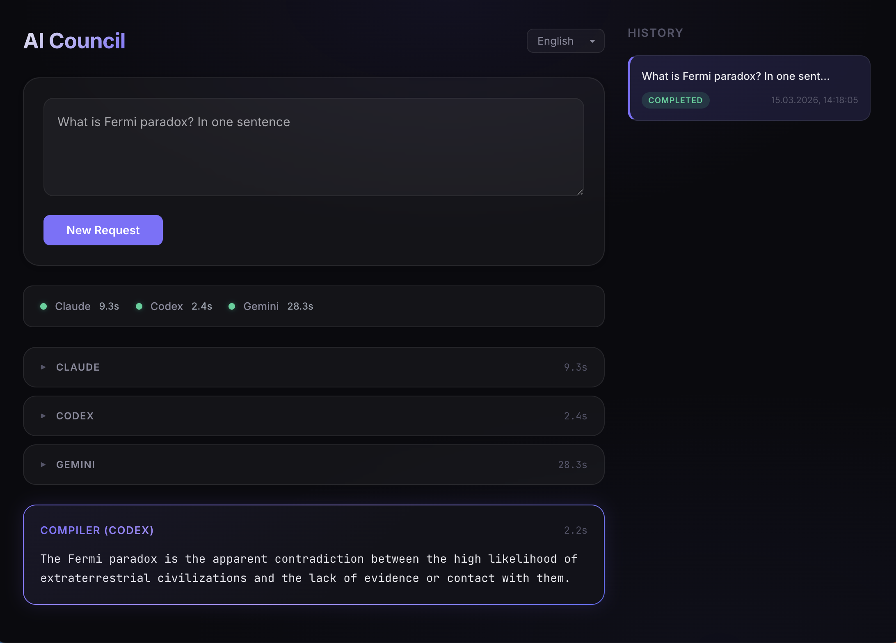

<p align="center">
  
</p>

<h1 align="center">AI Council</h1>

<p align="center">
  <strong>Спроси несколько ИИ. Получи один идеальный ответ.</strong>
</p>

<p align="center">
  <a href="./README.md">English</a> · <a href="./README.zh.md">中文</a>
</p>

<p align="center">
  
  
  
</p>

---

AI Council отправляет ваш запрос **любому количеству AI-систем** параллельно, собирает их ответы и передаёт выбранному ИИ-компилятору для синтеза единого ответа — выбирая лучшие идеи, разрешая противоречия и убирая дубли.

По умолчанию настроен на Claude, Codex и Gemini — но вы можете добавить любой CLI-совместимый ИИ (Grok, Ollama, локальные модели) одной строкой в конфиге.

Доступен как веб-интерфейс, REST API и MCP-сервер. Под капотом оркестрирует CLI-инструменты — никаких API-ключей не требуется.

<p align="center">
  
</p>

## Как это работает

```
Вы: "Как оптимизировать запрос в PostgreSQL?"
         │
         ├──→ Claude    ──→ "Используйте EXPLAIN ANALYZE, добавьте индексы..."
         ├──→ Codex     ──→ "Проверьте sequential scans, рассмотрите..."
         ├──→ Gemini    ──→ "Начните с анализа плана запроса..."
         ├──→ ...любой ИИ ──→ (добавляйте сколько хотите)
         │
         ▼
    ┌───────────┐
    │ Компилятор│  Анонимные ответы → один итоговый ответ
    └───────────┘
         │
         ▼
    "Вот полная стратегия оптимизации..."
```

1. Ваш запрос уходит всем настроенным ИИ-адвайзерам параллельно
2. Ответы анонимизируются (перемешиваются, получают метки A/B/C/...) для предотвращения предвзятости
3. ИИ-компилятор (на ваш выбор) синтезирует лучший объединённый ответ
4. Всё сохраняется в SQLite для истории и повторного просмотра

## Возможности

- **Консенсус нескольких ИИ** — опрашивайте 3, 5 или 10 ИИ одновременно и сравнивайте их подходы
- **Компиляция без предвзятости** — анонимизация ответов не даёт компилятору отдавать предпочтение какому-либо источнику
- **Подключаемые провайдеры** — добавьте любой CLI-совместимый ИИ одной строкой конфига; изменения кода не требуются
- **Два интерфейса** — веб-UI для интерактивной работы, MCP-сервер для интеграции с AI-инструментами
- **Отказоустойчивость** — таймаут одного ИИ не ломает всю сессию
- **История сессий** — просмотр, ревью и удаление прошлых сессий
- **i18n** — интерфейс на английском, русском и китайском

## Быстрый старт

### Требования

- **Node.js 22+**
- Хотя бы один установленный AI CLI (3 настроены по умолчанию): [`claude`](https://docs.anthropic.com/en/docs/claude-code), [`codex`](https://github.com/openai/codex), [`gemini`](https://github.com/google-gemini/gemini-cli), [`ollama`](https://ollama.com/) и т.д.

### Установка и запуск

```bash
git clone https://github.com/yanbrod/council
cd council
npm install

# Скопируйте и настройте конфиг провайдеров
cp council.example.json council.json

# Разработка (два терминала)
npm run dev:server   # Бэкенд на :3001
npm run dev:client   # Фронтенд на :3000

# — или продакшен —
npm run build
npm start            # Всё на :3001
```

Откройте [http://localhost:3000](http://localhost:3000) (dev) или [http://localhost:3001](http://localhost:3001) (production).

## Использование как MCP-сервер

AI Council также работает как [MCP](https://modelcontextprotocol.io/)-сервер — его можно вызывать напрямую из Claude Code, Claude Desktop или любого MCP-совместимого хоста.

### Подключение к Claude Code

Добавьте в `.claude/settings.json` или `~/.claude/settings.json`:

```json
{
  "mcpServers": {
    "ai-council": {
      "command": "node",
      "args": ["/абсолютный/путь/до/council/mcp-server.js"]
    }
  }
}
```

### Подключение к Claude Desktop

Добавьте в `~/Library/Application Support/Claude/claude_desktop_config.json`:

```json
{
  "mcpServers": {
    "ai-council": {
      "command": "node",
      "args": ["/абсолютный/путь/до/council/mcp-server.js"]
    }
  }
}
```

### MCP-инструменты

| Инструмент | Описание |
|------------|----------|
| `ask_council` | Отправляет запрос всем настроенным ИИ-адвайзерам, компилирует единый ответ. Параметры: `prompt` (string), `compiler` (имя провайдера) |

### Умное определение хоста

Когда MCP-сервер запущен внутри AI-хоста (например, Claude Code вызывает `ask_council`), он автоматически определяет родительский процесс и использует **MCP Sampling** вместо запуска конфликтующего CLI-процесса.

```
Запуск из Claude Code:
  Claude → MCP Sampling (без конфликта)
  Codex  → CLI spawn
  Gemini → CLI spawn

Запуск из терминала/API:
  Claude → CLI spawn
  Codex  → CLI spawn
  Gemini → CLI spawn
```

## Добавление провайдеров

Провайдеры настраиваются в `council.json`. Скопируйте из `council.example.json` и отредактируйте:

```json
{
  "providers": {
    "grok": {
      "command": "grok",
      "args": ["-p", "{prompt}"],
      "label": "Grok",
      "stdin": "pipe"
    }
  }
}
```

| Поле | Обязательно | Описание |
|------|-------------|----------|
| `command` | Да | Исполняемый файл CLI (должен быть в PATH) |
| `args` | Да | Массив аргументов. `{prompt}` заменяется на пользовательский ввод |
| `label` | Нет | Отображаемое имя в UI (по умолчанию — имя ключа) |
| `stdin` | Нет | `"pipe"` (по умолчанию) или `"ignore"` |

**Примеры:**

<details>
<summary>Grok CLI</summary>

```json
"grok": {
  "command": "grok",
  "args": ["-p", "{prompt}"],
  "label": "Grok",
  "stdin": "pipe"
}
```
</details>

<details>
<summary>Ollama (локальные модели)</summary>

```json
"ollama": {
  "command": "ollama",
  "args": ["run", "llama3", "{prompt}"],
  "label": "Ollama (Llama 3)",
  "stdin": "pipe"
}
```
</details>

Все провайдеры из `council.json` становятся адвайзерами (опрашиваются параллельно). Любой из них можно выбрать компилятором. Количество провайдеров не ограничено. Если `council.json` отсутствует, используются Claude + Codex + Gemini.

## Промпт компилятора

Шаблон промпта компилятора также настраивается в `council.json`:

```json
{
  "compilerPrompt": {
    "preamble": "The user asked the following question:",
    "responsesIntro": "Below are several independent responses from different AI systems.\nThey are anonymized.",
    "instructionsHeader": "Compile a single final response:",
    "instructions": [
      "Remove duplicates.",
      "Pick the strongest ideas.",
      "If there are contradictions, resolve them or explicitly note them.",
      "Make the result clear and coherent.",
      "Do not mention A/B/C in the final text.",
      "Respond in the same language as the user's original question."
    ]
  }
}
```

## Справочник API

### `POST /api/sessions` — Создание сессии (асинхронно)

```json
{ "prompt": "ваш вопрос", "compiler": "claude" }
→ { "sessionId": 1, "status": "created" }
```

Фронтенд опрашивает `GET /api/sessions/:id` до достижения терминального статуса.

### `POST /api/council` — Создание сессии (синхронно)

Блокирующий запрос — ждёт ответов всех ИИ и завершения работы компилятора:

```json
{ "prompt": "ваш вопрос", "compiler": "claude" }
→ {
    "sessionId": 1,
    "status": "completed",
    "advisors": [
      { "provider": "claude", "status": "success", "text": "...", "durationMs": 5000 },
      { "provider": "codex", "status": "success", "text": "...", "durationMs": 3000 },
      { "provider": "gemini", "status": "success", "text": "...", "durationMs": 4000 }
    ],
    "compiled": {
      "provider": "claude", "status": "success", "text": "...", "durationMs": 6000
    }
  }
```

### `GET /api/sessions` — Список сессий

### `GET /api/sessions/:id` — Детали сессии

### `DELETE /api/sessions/:id` — Удаление сессии

## Архитектура

```
┌─────────────────────────────────────────────────────────┐
│  AI-хост (Claude Code / Codex / Gemini)                 │
│                                                         │
│  ┌───────────────────────────────────────────────────┐  │
│  │  MCP-сервер (mcp-server.js)                       │  │
│  │                                                   │  │
│  │  ask_council(prompt, compiler)                     │  │
│  │    │                                              │  │
│  │    ├── Хост-провайдер → MCP Sampling ◄────────────┼──┘
│  │    ├── Провайдер 2    → CLI spawn                 │
│  │    ├── Провайдер 3    → CLI spawn                 │
│  │    │                                              │
│  │    ├── Анонимизация (shuffle + метки A/B/C)       │
│  │    ├── Компилятор → CLI spawn / Sampling          │
│  │    └── Результат → SQLite + ответ                 │
│  └───────────────────────────────────────────────────┘
└─────────────────────────────────────────────────────────┘
```

## Технологии

| Слой | Технология |
|------|-----------|
| Бэкенд | Node.js, Express, better-sqlite3 |
| Фронтенд | Preact, TypeScript, Rspack |
| MCP | @modelcontextprotocol/sdk (stdio transport) |

## Тестирование

```bash
npm test
```

## Лицензия

[MIT](LICENSE)

---

<sub>Этот проект почти полностью создан с помощью ИИ (Claude, Codex, Gemini — да, теми самыми, которыми он и управляет). Баги и шероховатости возможны. Issues и PR приветствуются.</sub>
